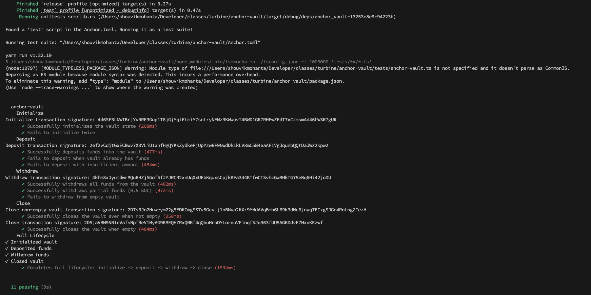

# Anchor Vault Program

This is a Solana Vault program built with the Anchor framework. It allows users to initialize a vault, deposit SOL, withdraw SOL, and close the vault.

## Project Structure

- **programs/anchor-vault**: The Solana program logic.
- **tests/anchor-vault.ts**: Integration tests for the program.
- **assets/**: Screenshots and other assets.

## Instructions Implemented

The program supports the following instructions:

1.  **Initialize**: Sets up the vault account.
2.  **Deposit**: Allows a user to deposit SOL into the vault.
3.  **Withdraw**: Allows a user to withdraw SOL from the vault.
4.  **Close**: Closes the vault account and returns the rent to the user.

## Testing

The program has been thoroughly tested using the Anchor test framework.

### Test Results



To run the tests yourself:

```bash
anchor test
```

## Deployment

Program ID: `68BPmfA8aQEMcFFNU2x1VEXEg3xB46jpGevuwcT2dt2S`

